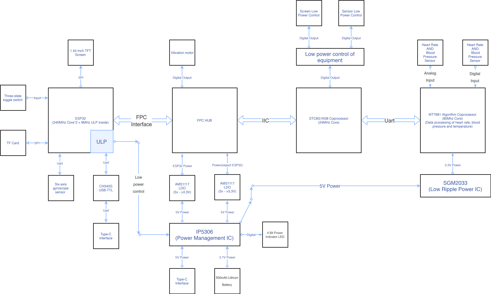
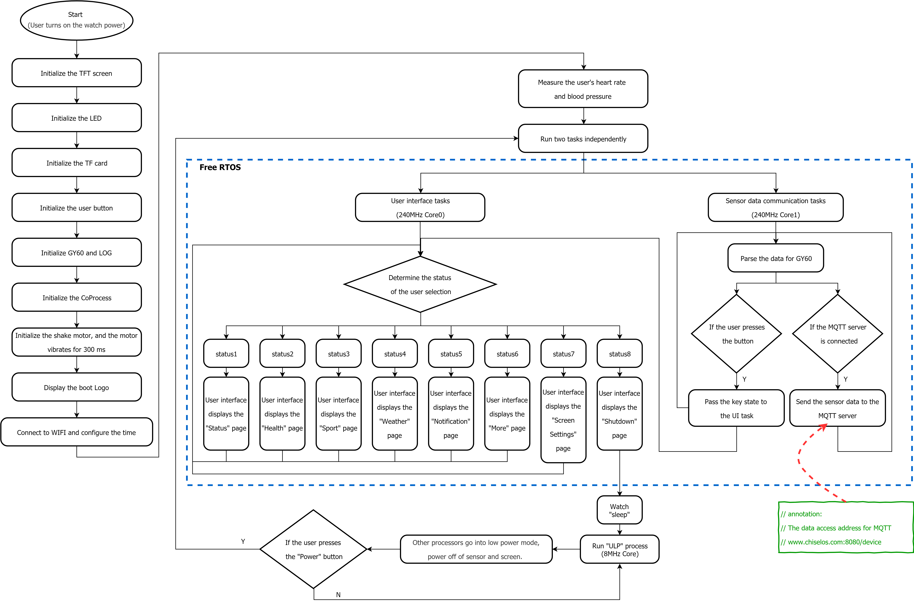

# PineconePi Watch:一个基于ESP32+STC8的物联网手表
## 作者:xddcore(Chengsen Dong)|大二课程系统设计
## Email:1034029664@qq.com
## Github:www.github.com/xddcore
## Version:1.2
## Date:20/04/2021
## 效果视频:https://www.bilibili.com/video/BV1AA411V7fJ?spm_id_from=333.999.0.0

# 项目简介
**PineconePi Watch** ESP32+STC8；6轴陀螺仪+心率+体温；MQTT；双层0603 SMD电路板；两块电路板FPC连接；1.44英寸OLED显示屏；拨动开关；IP5306+500maH可充电锂电池；Type-C可二次开发；

# 项目特性

为了更加直观的展示项目的硬件结构，将项目硬件框图展示如上。现在将对硬件框图进行详细的介绍：
1.	本设备硬件由3个微控制器，5个核心组成。其中ESP32与STC8协处理器通过FPC排线连接。它们使用IIC通信协议进行通信和数据传输。
2.	设备电源由IP5306电源管理芯片进行管理。IP5306可以根据实际情况自动选择设备电源由TYPE-C接口提供或由内部500mAh锂电池提供。同时，IP5306电源管理芯片还可以为锂电池进行充电，并通过4位LED灯指示设备电量。
3.	程序下载和与计算机的串口通信通过CH340G USB-TTL芯片将USB电平和TTL电平进行转换。
4.	ESP32内部的8MHz ULP处理器主要用于当设备休眠时，控制设备的低功耗功能。
5.	STC8协处理器主要用于处理MT7681算法芯片通过串口传输过来的数据，并将数据通过IIC协议传输至ESP32中。同时STC8协处理器对设备TFT屏幕的电源以及传感器的电源进行控制。
6.	用户通过3状态拨码开关控制设备。
7.	MT7681算法芯片读取心率血压传感器和体温传感器的数据，并通过串口将数据传输给STC8协处理器。

# 软件流程图(充分利用ESP32双核+ULP低功耗小核）

